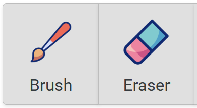
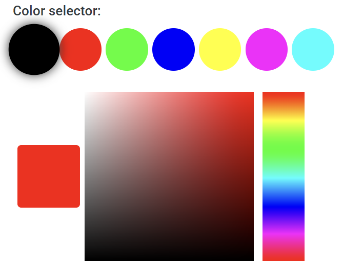
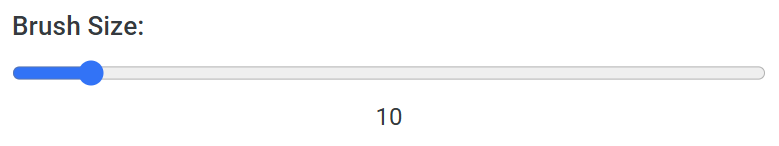
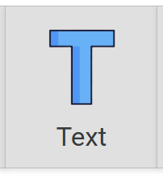
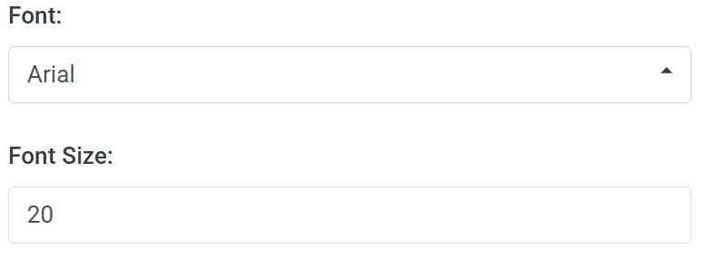
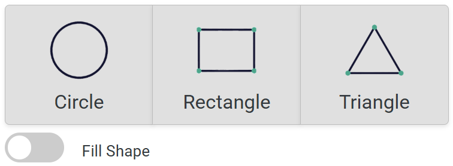
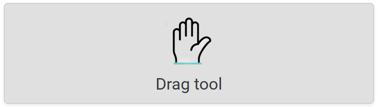
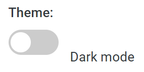

# SS-Assignment_01-Web_Canvas
# Software Studio 2025 Spring
## Assignment 01 Web Canvas

### Scoring

| **Basic components** | **Score** | **Check** |
| :------------------- | :-------: | :-------: |
| Basic control tools  |    30%    |     Y     |
| Text input           |    10%    |     Y     |
| Cursor icon          |    10%    |     Y     |
| Refresh button       |    5%     |     Y     |

| **Advanced tools**     | **Score** | **Check** |
| :--------------------- | :-------: | :-------: |
| Different brush shapes |    15%    |     Y     |
| Un/Re-do button        |    10%    |     Y     |
| Image tool             |    5%     |     Y     |
| Download               |    5%     |     Y     |

| **Other useful widgets** | **Score** | **Check** |
| :----------------------- | :-------: | :-------: |
| Drag Tool, Theme Toggle, Transparency Adjustment...       |   1~5%    |     Y     |

---

### How to Use

    This section provides a detailed guide on how to use the web application, including descriptions of its tools and features.

#### Basic Control Tools

- **Brush and Eraser**  

    Click the "Brush" or "Eraser" button to use the mouse for drawing or erasing on the canvas. The eraser can remove everything on the canvas, including uploaded images.

- **Color Selector**  

    Click to select a color. You can choose from commonly used colors or use the color slider and palette for more options.

- **Simple Menu (Brush Size)**  

    Adjust the brush size by moving the slider with the mouse.

- **Text Input**

    Click the "Text" button to enter text input mode. Click on the desired location on the canvas to open a text box. After typing, press the Enter key to confirm, and the text will appear at the specified position.

- **Font Menu (Typeface and Size)**  

    Use the menu to select a font type. Adjust the font size by entering a number.

- **Cursor Icon**  
    Each tool has a unique cursor icon, making it easy to identify the currently selected tool.

- **Refresh Button**  

    Click the "Clear" button to reset the canvas. A confirmation dialog will appear. Once confirmed, all content on the canvas will be cleared. This action can be undone using the Undo button and redone using the Redo button.

#### Advanced Tools

- **Different Brush Shapes**  

    Includes circle, rectangle, and triangle brushes (5% for each shape). Drag the cursor to draw shapes of varying sizes. Click the corresponding button to activate the desired shape tool.

- **Un/Re-do Button** 

    Click the "Undo" button to revert to the previous action. Click the "Redo" button to cancel an Undo action. Keyboard shortcuts Ctrl+Z and Ctrl+Y are also supported.

- **Image Tool**  

    Click the "Upload" button to select and upload an image from your local device. After uploading, use the mouse to adjust the image's position and the scroll wheel to resize it. Confirm placement by clicking the left mouse button.

- **Download**  

    Click the "Download" button to save the current canvas as a PNG image file without a background.

### Bonus Function Description

This section describes additional bonus features and their usage:

1. **Drag Tool**  

     Click the "Drag" button to enter drag mode. Use the mouse to move the canvas and the scroll wheel to zoom in or out.

2. **Theme Toggle**  
     Use the "Theme" button to switch between light and dark modes.

3. **Transparency Adjustment**  
     A transparency slider is added to the Simple Menu. Adjust the transparency by moving the slider with the mouse.

4. **Straight Line Tool**  
     A straight-line drawing tool is available under "Different Brush Shapes." It operates similarly to other drawing tools.

### Web page link

    your web page URL.

- https://ss-assignment01-webcanvas.web.app
- https://ss-assignment01-webcanvas.firebaseapp.com/

### Others (Optional)

    Anything you want to say to TAs.

Thank you for reviewing our work! I truly appreciate the time and effort you’ve put into evaluating this assignment. Your feedback is invaluable to me, and I hope my submission meets your expectations. Thanks again for your hard work and dedication!

#### highlights of the project:

1. **Enhanced User Experience**:
   - Smooth light/dark mode transitions.
   - Interactive buttons with hover and active feedback.

2. **Advanced Tools**:
   - Custom color picker with gradient-based selection.
   - Undo/Redo functionality with keyboard shortcuts (`Ctrl+Z`/`Ctrl+Y`).

3. **Bonus Features**:
   - "Fill Shape" toggle for hollow/solid shapes.
   - Cursor overlay showing brush size, color, and transparency.

4. **Optimized Design**:
   - Responsive layout for all screen sizes.
   - Consistent and reusable styles for better maintainability.

#### Optimization Features

1. When using the brush or eraser, a circular overlay appears at the cursor, indicating the current color, transparency, and brush size for better precision.
2. A "Fill Shape" toggle is available to switch between hollow and solid shapes for circle, rectangle, and triangle brushes.
3. Enhanced button designs include hover and selection feedback, with animations for selected icons.
4. Switching themes (light/dark mode) includes special transition effects.